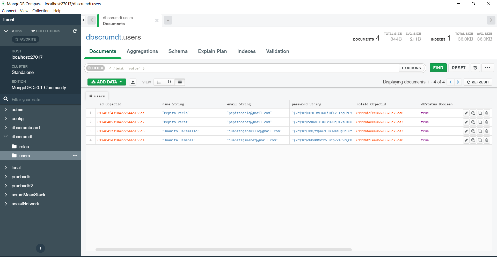
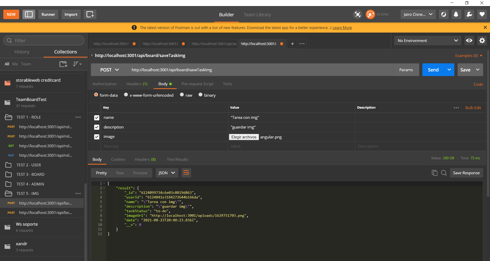

# Configuración de NodeJS,ExpressJS con MongoDB 

Para configurar un proyecto con NodeJs, debe tenerse clara la estructura del proyecto. Es importante separar las responsabilidades del Backend y del FrontEnd

El BackEnd de un proyecto es la parte lógica que permite que todas las acciones solicitadas en una página web sean ejecutadas correctamente. El trabajo que realiza, se encuentra del lado del servidor y procesa la información recibida a través del FrontEnd.

El FrontEnd de un proyecto es la parte visual y es la que permite al usuario interactuar con una aplicación.

### 1. Archivo .gitignore
Es un archivo de texto en el cual se le indica a Git qué archivos o carpetas ignorar en un proyecto y que no sea necesario almacenarlas en un repositorio.
Este archivo se edita según sea necesario. Cada nueva línea debe incluir un archivo o carpeta adicional requiera ser omitido por Git. Debe crearse en la raíz del proyecto.

En este caso, el proyecto se encuentra en una carpeta raíz, con dos subcarpetas:


		DianaTrianaTeamBoard
			|   backend

El archivo .gitignore se ubicará por fuera de las carpetas backend y frontend y contendrá las siguientes líneas:

```
/backend/node_modules
/frontend/node_modules
```
De esta manera al actualizar el repositorio en github, las carpetas node_modules serán omitidas durante el proceso.


### 2. NPM

En este caso, se está desarrollando el proyecto sobre Visual Studio. Para ejecutar los comandos de NodeJS, se debe trabajar en la Terminal del editor, teniendo en cuenta que esté configurada como cmd, en el caso de Windows.

```
npm init
```


Este comando permite inicializar la aplicación como un proyecto NodeJs. Al ejecutarlo, el programa despliega una serie de preguntas, las cuales sirven como base para crear el archivo **packaje.json**. Este archivo contiene la información de las librerías con las cuales fue desarrollado el proyecto.

### 3. Instalación de paquetes básicos
Para que el proyecto pueda conectarse a la base de datos, además de tener acceso a otras funcionalidades básicas para el despliegue de esta aplicación, se requiere instalar los siguientes paquetes, los cuales pueden ser consultados en el sitio oficial de  [NPM](https://www.npmjs.com/)
- **express**: Permite que el sistema operativo pueda ejecutar el servidor de nuestra aplicación.
- **mongoose**: Contiene lo necesario para poder realizar la conexión a una base de datos  Mongo.
- **cors**: Es una libreria que permite hacer el manejo de los CORS de la aplicación.
- **jsonwebtoken**: Permite manejar token de seguridad en el intercambio de información entre el backend y el frontend de la aplicación.
- **bcrypt**: Encripta la información y no la desencripta para garantizar la seguridad.
- **moment**: Esta librería facilita el manejo de fechas directamente desde el servidor de NodeJS.
- **connect-multiparty**: Permite la manipulación de archivos en el proyecto.

La opción *- -save* es opcional pero garantiza que los paquetes se almacen e instalen correctamente en la aplicación.
```
npm i express mongoose cors jsonwebtoken bcrypt moment connect-multiparty --save
```
Aunque se puede instalar cada paquete de uno en uno, tambien se pueden instalar todos en una sola línea con el fin agilizar el proceso.


Siempre que se instalan las librerías, el archivo **package.json** también se  actualiza, almacenando los paquetes instalados y las versiones que tenían al momento de su descarga:
```
 "dependencies": {
    "bcrypt": "^5.0.1",
    "connect-multiparty": "^2.2.0",
    "cors": "^2.8.5",
    "dotenv": "^10.0.0",
    "express": "^4.17.1",
    "jsonwebtoken": "^8.5.1",
    "moment": "^2.29.1",
    "mongoose": "^5.13.5"
  }
```
### 4. Instalación de paquetes  para developers:
- **nodemon**:  Es un paquete que monitorea los cambios en el código  que se está desarrollando y automáticamente reinicia el servidor. Sin embargo, este paquete es útil únicamente durante el desarrollo de la aplicación. Por este motivo, durante su instalación, se adiciona el parámentro **-dev**.
```
npm i nodemon --save-dev
```
Lo cual a su vez, actualiza el archivo **package.json** pero en una variable diferente:
```
  "devDependencies": {
    "nodemon": "^2.0.12"
  }
```
### 5. Archivo .env
Primero, se debe instalar la librería **dotenv** para que este archivo (.env), sea entendible como archivo de configuración de variables de entorno: 
```
npm i dotenv --save
```
El archivo .env debe crearse en la raíz del proyecto, en este caso, en la carpeta **backend**.
Este archivo contiene las constantes que quedarán disponibles para todo el ámbito del proyecto, y que se utilizan en diferentes lugares de la aplicación.
En este caso, tendrán almacenadas las constantes:

- **PORT**, la cual es el puerto sobre el cual se ejecuta la aplicación.
-  **BD_CONNECTION**, la cual contiene el acceso a la base de datos a la cual se conectará el proyecto.
-  **SECRET_KEY_JWT**, que es una variable que se le adicionará a los token, para incrementar el grado de seguridad de los token que se intercambian en las aplicaciones.

```
PORT=3001
BD_CONNECTION=mongodb://127.0.0.1:27017/xxxxxxx
SECRET_KEY_JWT=SecretKey210804
```
### 6. Archivo db.js
Para almacenar los parámetros de configuración de la base de datos, primer se debe crear una carpeta llamada db:

		DianaTrianaTeamBoard
			|   backend
					|db

Dentro de esa carpeta, se debe crear el archivo **db.js** el cual tendrá los parámetros para establecer la conexión a la base de datos:
```
const mongoose = require("mongoose");
const dbConnection = async () => {
    try {
        await mongoose.connect(process.env.BD_CONNECTION, {
            useNewUrlParser: true,
            useFindAndModify: false,
            useCreateIndex: true,
            useUnifiedTopology: true
        });
        console.log("Connection with MongoDB: ON");
    } catch (e) {
        console.log("Error connecting to MongoDB: ", e);
        throw new Error("Error connecting to MongoDB");

    }
}
module.exports = {dbConnection}
```

- Se crea una constante para instanciar la librería *Mongoose*, en este caso se llamará **mongoose**, porque por buenas prácticas es conveniente llamarla como la librería.
- Se genera una *arrow function*, la cual nos permitirá establecer la conexión con la base de datos.  Esta función se maneja de manera asíncrona. Se indica con la palabra reservada **async**. Lo cual permite ejecutar otras tareas o funcionalidades, mientras el proceso de  conexión con la base de datos retorna una respuesta, es decir, una *promesa*.

- Try/Catch: Es un bloque de código para la gestión de excepciones. Es decir, una respuesta inesperada por parte del servidor.

- Siempre que exista un **async**, debe completarse con un **await** porque es la parte que completa una *promesa*.

- Para la conexión a la base de datos, se utiliza la función **connect** de **mongoose**. Adicional, se pueden agregar unas opciones que permiten que la conexión establecida sea segura y estable:
**useNewUrlParser**: En true, cada vez que se ejecute una función que se conecte a Mongo, las ruta que se maneje, estará encriptada. No mostrará datos en consola.
**useFindAndModify**: En consola no aparecerá nada de lo realizado al momento de realizar una tarea de actualización en la base.
**useCreateIndex**: Permite organizar los logs de la aplicación.
**useUnifiedTopology**: Unifica la escritura de Mongo en mensajes de respuesta.

- En el **catch** por medio de la **(e)**, se captura el cualquier error inesperado por parte de la base de datos. Y por consola, se escribe el mensaje retornado por la aplicación sin afectar la experiencia de usuario.

- El **throw**, permite manejar el error que retorna el navegador de manera discreta, sin mostrar errores vistosos de color rojo.

- **module.exports** permite que el módulo de conexión a la base de datos quede público dentro de la aplicación y se pueda invocar desde cualquier otro módulo.

### 7. Archivo index.js
El archivo index.js se debe configurar para que sea el servidor de la aplicación.
```
const express = require('express');
const cors = require('cors');
const {dbConnection} = require('./db/db');

require("dotenv").config();

const app = express();

app.use(express.json());
app.use(cors());

app.listen( process.env.PORT, () =>
    console.log("Backend server running on port: " + process.env.PORT )
);

dbConnection();
```
- **const express:** Con esta constante se invoca la librería expressJS, la cual permite que el index.js funcione como un servidor NodeJS.

- **const cors: ** En esta constante se importa la librería que permite realizar el manejo de los CORS o condiciones de manejo de cabeceras del back.

- **const {dbConnection}**: Se invoca el archivo db.js sin necesidad de colocar la extensión. Esto permite tener disponible la conexión a la base de datos, una vez iniciado el servidor de la aplicación.

- **require("dotenv").config()**: Permite tener acceso al archivo .env y así a las variables de entorno definidas en él.

- **const app = express()**: Esto indica que todas las funcionalidades de servidor de nuestra aplicación, dependen de la librería **express**. Por buena práctica, es conveniente que la variable que define el servidor se llame ***app***.

- **app.use(express.json())**: Esto indica que todo lo que va a manipular el servidor va a ser con formato **.json**.  (Recibir, enviar información)

- **app.use(cors())**: Define los encabezados que van a ser manejandos en los servicios.

- **Se crea *arrow function* app.listen**: Esto indica que la aplicación va a escuchar por medio de un puerto. Y se le indica que el puerto de conexión definido en el archivo .env

- **dbConnection()**: Por último, se establece la conexión a la base de datos, gracias a que se importó el módulo dbConnection.

### 8. Comprobar funcionamiento del servidor backend.
Primero se valida que el servicio de MongoDB se inicie correctamente:
Se ejecuta el archivo mongo.exe ubicada en la carpeta Server:

Si se queda ejecutando un proceso, esto indica que el servicio de Mongo se está ejecutando correctamente:


Una vez verificada la base, se procede a ejecutar el servidor de NodeJS desde la terminal de Visual Studio, con el siguiente comando:
```
npm start
```
Si es servidor se ejecuta correctamente, deben visualizarse las siguientes líneas en la terminal:
```
[nodemon] 2.0.12
[nodemon] to restart at any time, enter `rs`
[nodemon] watching path(s): *.*
[nodemon] watching extensions: js,mjs,json  
[nodemon] starting `node index.js`
Backend server running on port: 3001
Connection with MongoDB: ON
```


Para terminar la ejecución del servidor, se presiona **Ctrl+c**.


# Validación del proceso

## Usuarios

Visualización las colleciones roles y users creadas previamente en MongoDB por medio de compass:


1. Visualización de los usuarios:


2. Visualización del Upload de la imagen:
 


3.  Visualización de la imagen en el navegador:
 

